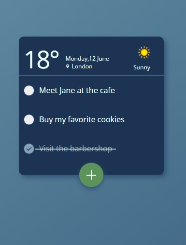

# ToDo's
---
## Task
Develop a To-Do application with a user-friendly interface.\
The application must display date and weather.\
User tasks should be stored in localStorage.
***
## Result 
### >>> [gh-pages](https://isildurrr1.github.io/todos-react/) <<<

---
## Technology stack
- HTML
- SASS (BEM methodology)
- TypeScript
- React
- Vite
---
## API
- Calculation of the user's city by IP [ipapi](https://ipapi.co/)
- Weather query for the user's city [Weatherapi](https://www.weatherapi.com/)
---

